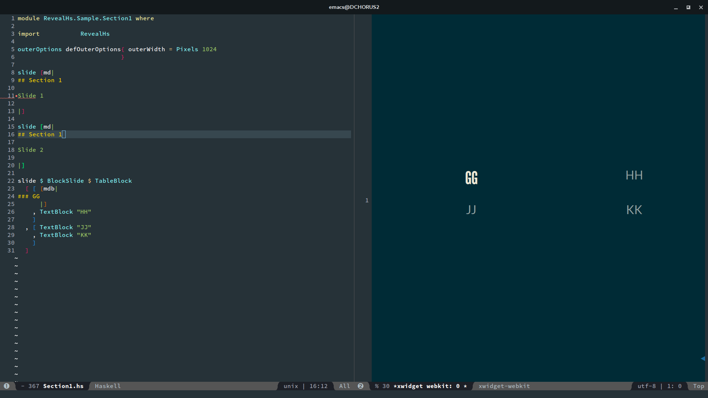

# reveal-hs
Write your Reveal.js presentations in Haskell!

## Demo


## Current status

This project is far from being complete. Currently only markdown quasiquoter is implemented.


## Usage

With reveal-hs, each presentation is a stack project.

* Add reveal-hs to your `packages` list in `stack.yaml`.
* Write your slides.
* `stack clean; stack build;  stack exec your-project-exe > output.html`.
* That's it! Open `output.html` with your favorite browser and check your work!

Note: 

1. reveal-js requires Template Haskell to work so as to avoid boilerplate code.
But to ensure all slide groups (haskell modules) are built into the final executable, you will
have to do `stack clean` prior to build, otherwise you will risk missing some (if not all) 
slides from the output.
1. Make sure to import all slide modules from the main module in the order they occur.


## How to write slides

### Basics

The slides are organized as follows:

1. Slides defined in a module are shown vertically (switch with Up/Down keys)
   The order they are displayed is exactly the same as the order they are defined.
1. Slides defined across modules are organized in a horizontal manner.
   The order they are spread out is reflected by the `import` statements in the main module.
   
For example, if you have modules `Hello.A` and `Hello.B`:

```haskell
module Hello.A where

slide [md|
# A1
|]

slide [md|
# A2
|]
```

and

```haskell
module Hello.B where

slide [md|
# B1
|]

slide [md|
# B2
|]
```

in your Main.hs:

```haskell
import Hello.A
import Hello.B
```

then the slides are organized as follows:

```
/-----\    /-----\
| A 1 | -- | B 1 |
\-----/    \-----/
   |          |
   |          |
/-----\    /-----\
| A 2 |    | B 2 |
\-----/    \-----/
```

It's suggested that you enable `-XQuasiQuotes` and `-XTemplateHaskell` globally. You can add
```
default-extensions:  QuasiQuotes
                   , TemplateHaskell
```
to the executable configuration section in your `.cabal` file.

And then writing a slide is as easy as follows:

```haskell
module Hello where

import RevealHs

slide [md|
# Add your markdown
|]

slide [md|
# Another slide
|]
```

(the `md` quasiquoter supports string interpolation.
Use `#{var}` to interpolate values.)

In your Main.hs file:

```haskell
module Main where

import           RevealHs
import           Hello

mkRevealPage def { revealJsRoot = "/path/to/your/reveal.js/root"
                 , theme = "moon"  -- When removed, default to "night"
                 , transition = TransitionSlide  -- Default is probably TransisionConvex
                 , width = Pixels 1024  -- Default is Pixels 960. You can say `Percentage xx` as well
                 ...
                 }
```

Everything in the record, except `revealJsRoot`, is optional.

After things get done, you are ready to run a sequence of stack commands to generate your presentation:

```
$ stack clean
$ stack build
$ stack exec your-project-exe > output.html
```

Since reveal-hs depends on Template Haskell and is compilation sensitive, some essential actions will not get triggered under incremental build. Thus we do `stack clean` to ensure everything gets the chance to run. (Need to improve?)


### Advanced

#### Column layout

Reveal-hs supports column layout, e.g. a 2x2 table:

```haskell
slide $ BlockSlide $ TableBlock
  [ [ [mdb|
### GG
      |]
    , TextBlock "HH"
    ]
  , [ TextBlock "JJ"
    , TextBlock "KK"
    ]
  ]
```
  
The `md` quasiquoter is renamed to `mdb` (meaning "markdown block") to typecheck.
Not quite necessary and it is likely to be improved in the future.

`TableBlock` is a bad name. It is not necessarily a table 
because the number of columns can vary across rows. Each row will just stretch its content to fit the available horizontal space of its container.

Result:



#### Configuration

TODO
